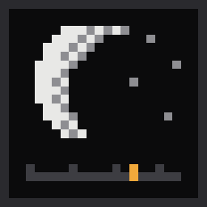
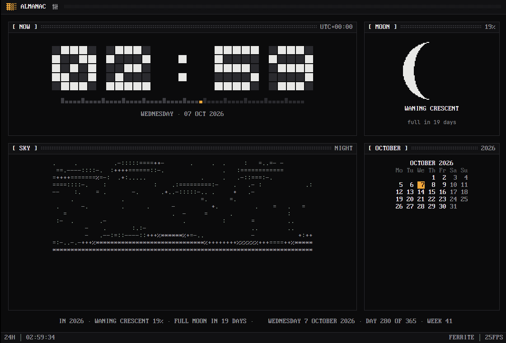
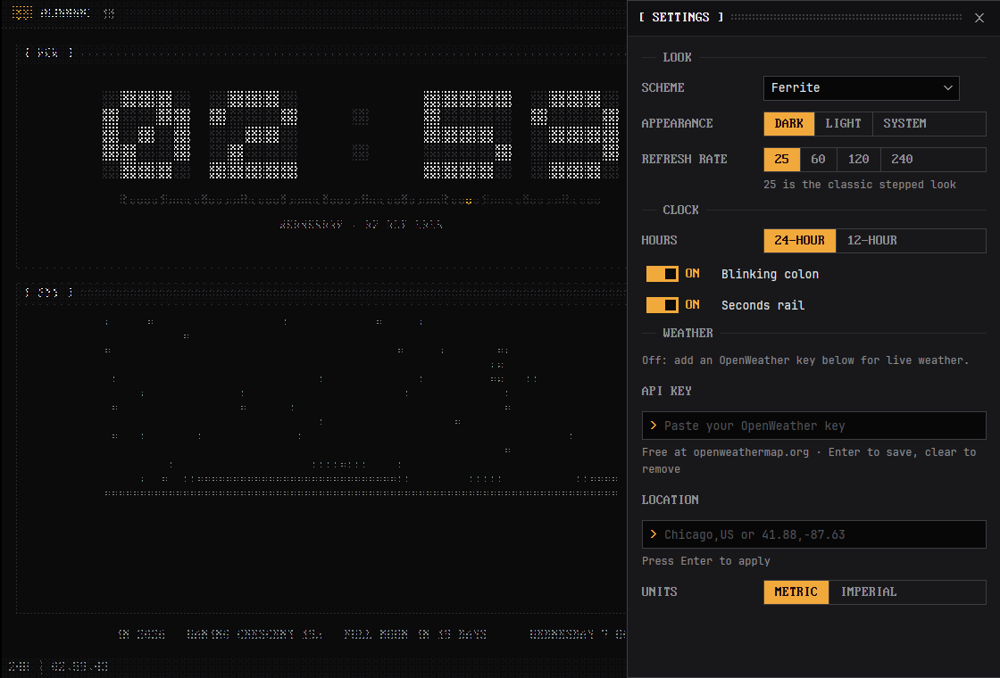
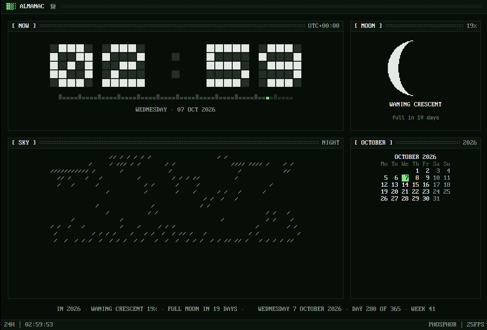

<p align="center">
  
</p>

<h1 align="center">Almanac</h1>

<p align="center">
  A <a href="https://github.com/rwetz/ferrite-design">Ferrite</a> clock for a second screen:
  block digits, the moon in dither, a live ASCII weather sky.
</p>

<p align="center">
  <a href="https://github.com/rwetz/ferrite-almanac/actions/workflows/ci.yml"></a>
  <a href="https://github.com/rwetz/ferrite-almanac/releases/latest"></a>
  <a href="LICENSE"></a>
</p>



Almanac is a clock you leave open on a spare monitor. Big block digits sit
over their own dim segments, a seconds rail ticks underneath, the moon shows
its real phase, and a looping ASCII sky follows the part of the day. With a
location set the sky shows the actual weather outside, and dawn and
dusk follow the real sunrise and sunset.

It's a native desktop app built with [GPUI](https://gpui.rs) and
[ferrite-design](https://github.com/rwetz/ferrite-design): amber on iron,
0px corners, pixel type and stepped motion. It runs no webview.

## Features

- **The clock.** Block-font digits over their unlit segments, a blinking
  colon, a 60-cell seconds rail, and a 12- or 24-hour face.
- **The moon.** Today's phase drawn in dither, with its name, how much of it
  is lit, and how many days until the next full moon.
- **The sky.** A looping ASCII film for night, dawn, day and dusk, with the
  sun moving across it. With weather on, the film shows clear skies, clouds,
  rain, snow, fog or storms as they happen, and the panel reports the
  temperature, wind and humidity.
- **The almanac.** This month's calendar and a ticker: the day of the year,
  the week, the quarter, the days left in the year and the moon's progress.
- **Ferrite throughout.** Ten color schemes, a command palette
  (<kbd>Ctrl</kbd>+<kbd>Shift</kbd>+<kbd>P</kbd>), a Settings drawer
  (<kbd>Ctrl</kbd>+<kbd>,</kbd>), a boot screen, and a CRT switch-off when you
  close the window.

| Settings | Phosphor scheme, raining |
|---|---|
|  |  |

## Install

### Download

Prebuilt binaries for Windows, macOS and Linux are attached to each
[release](https://github.com/rwetz/ferrite-almanac/releases/latest).
Unpack the archive and run `ferrite-almanac`. Nothing else is needed.

### From source

```bash
git clone https://github.com/rwetz/ferrite-almanac
cd ferrite-almanac
cargo run --release
```

On Linux you need the usual GPUI development packages first:

```bash
sudo apt install libxkbcommon-dev libxkbcommon-x11-dev libwayland-dev libxcb1-dev libfontconfig-dev
```

On macOS with Xcode 27 or later, install the Metal toolchain once:

```bash
xcodebuild -downloadComponent MetalToolchain
```

## Live weather

Weather is optional. Without it the sky still runs through the day using
your clock. To turn it on:

1. Open Settings and enter a **Location**, such as `Chicago,US` or `41.88,-87.63`.
2. Press **Enter**. Live weather comes from [Open-Meteo](https://open-meteo.com/), with no API key.

Almanac refreshes every ten minutes. Clear the location to turn live weather off,
unless `ALMANAC_LOCATION` is set.

## Configuration

Settings are saved as plain `key = value` lines:

| OS | Settings |
|---|---|
| Windows | `%APPDATA%\ferrite\almanac.conf` |
| macOS | `~/Library/Application Support/ferrite/almanac.conf` |
| Linux | `$XDG_CONFIG_HOME/ferrite/almanac.conf` (or `~/.config/…`) |

```ini
scheme = ferrite      # ferrite mono graphite slate concrete harbor cyanotype phosphor verdigris bruise
appearance = dark     # dark | light | system
fps = 25              # 12–240; 25 is the classic stepped look
hours = 24            # 24 | 12
blink = true          # blinking colon
seconds = true        # seconds rail
location = Chicago,US # a city or "lat,lon"
units = metric        # metric | imperial
```

Environment variables override the files:

| Variable | Effect |
|---|---|
| `ALMANAC_LOCATION` | Used when no location is set in Settings. |
| `ALMANAC_SKY` | Previews a sky without live weather: `clear`, `clouds`, `rain`, `snow`, `fog` or `storm`. |
| `FERRITE_*` | The shared look from [Lodestone](https://github.com/rwetz/ferrite-lodestone); provides defaults until the app saves its own preferences. |

`ferrite-almanac --settings` starts with Settings open.

## With Lodestone

[Lodestone](https://github.com/rwetz/ferrite-lodestone) launches Ferrite apps
from their **source checkouts**: it scans a folder for crates that depend on
ferrite-design, runs `cargo build`, and starts the result with its shared
look. To see Almanac there, clone this repo next to Lodestone (or into the
folder you point Lodestone at) and have a Rust toolchain on your `PATH`:

```
Dev/
├── ferrite-lodestone/
└── ferrite-almanac/     # appears as a tile in Lodestone
```

A downloaded Almanac binary runs fine on its own, but Lodestone doesn't
discover installed binaries.

## Development

```bash
cargo test                    # the clock face, moon phases, sky scenes, weather parsing, settings
cargo clippy --all-targets
ALMANAC_SKY=storm cargo run   # try a sky without live weather
```

- `src/almanac.rs`: the clock face, moon phase, parts of the day and ticker.
  All pure and unit-tested.
- `src/sky.rs`: renders the sky film's frames.
- `src/weather.rs`: Open-Meteo config, fetching and parsing; no API key.
- `src/settings.rs`: the settings file.
- `src/main.rs`: the views. It follows ferrite-design's
  [AGENTS.md](https://github.com/rwetz/ferrite-design/blob/main/AGENTS.md).

On Windows, `build.rs` embeds `assets/logo.ico` as the executable and window
icon. The `.ico` is generated from `assets/logo.svg`, so regenerate it when
the logo changes.

## License

Apache-2.0, see [LICENSE](LICENSE). The binary embeds fonts from
ferrite-design under their own licenses; see [NOTICE](NOTICE).
